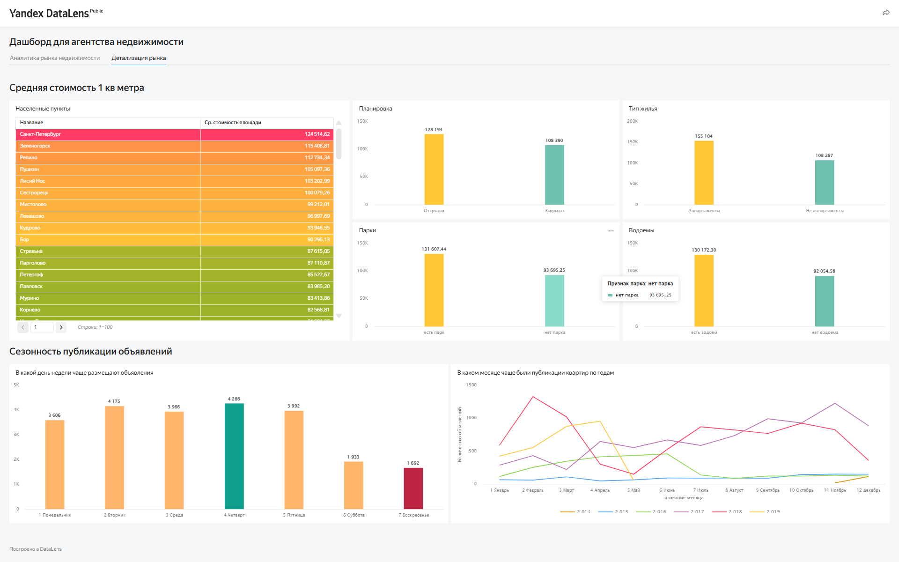

# Анализ рынка недвижимости Санкт-Петербурга и Ленинградской области — SQL + Yandex DataLens

## 📊 О проекте

Проект выполнен для аналитического агентства, которому требовалось определить самые перспективные сегменты жилой недвижимости в Санкт-Петербурге и Ленинградской области. На основе архивных данных сервиса «Яндекс Недвижимость» были решены две ad‑hoc задачи с помощью SQL, а затем доработан существующий дашборд в Yandex DataLens.

**Цели исследования:**
- Выявить сегменты недвижимости с наиболее коротким / длинным сроком продажи.
- Определить сезонные тенденции публикаций и продаж.
- Дополнить дашборд новыми фильтрами и визуализациями для удобного мониторинга рынка.

Результаты помогут заказчику сформировать бизнес-стратегию, выбрать перспективные районы и оптимальное время для выхода на рынок.

## 🛠 Инструменты

- **SQL** (DBeaver, PostgreSQL) — написание запросов, агрегация данных, оконные функции.
- **Yandex DataLens** — построение и доработка интерактивного дашборда.
- **Git / GitHub** — управление версиями и публикация портфолио.

## 📁 Структура репозитория
real-estate-spb-lo/  
├── README.md  
├── /sql  
│ └── real_estate_analytics.sql # все SQL-запросы для обеих задач  
├── /dashboard  
│ ├── /images  
│ │ ├── overview.png # общий вид дашборда  
│ │ ├── details.png # детализация  
│ └── links.txt # ссылка на опубликованный дашборд  

## 🗃 SQL‑запросы

Все запросы для решения ad‑hoc задач (время активности объявлений и сезонность) собраны в одном файле:  
👉 **[`sql/real_estate_analytics.sql`](./sql/real_estate_analytics.sql)**

Файл содержит:
- Фильтрацию данных от аномальных значений.  
- Подготовку данных: фильтрация по городам, годам (2015–2018), отбор только актуальных объявлений.
- Разделение объявлений на категории по сроку активности (1–30 дней, 31–90, 91–181, 181+, «активные объявления»).
- Расчёт средних значений: цена за м², общая площадь, количество комнат, балконов.
- Анализ сезонности: количество публикаций и снятий по месяцам, динамика цен и сроков продажи.
- Сравнение показателей для Санкт-Петербурга и городов Ленинградской области.

## 🔍 Аналитические выводы

### Задача 1. Время активности объявлений

**Цель:** разделить объявления на категории по времени активности и сравнить параметры квартир между Санкт-Петербургом и городами Ленинградской области.

**Основные метрики:**
- Количество объявлений в каждой категории.
- Средняя стоимость квартиры и квадратного метра.
- Средняя общая площадь, количество комнат, балконов.

**Ключевые выводы:**

1. **Самые массовые сегменты**  
   - В **Санкт-Петербурге** преобладают объявления со сроком «более полугода» — **31%** (3 489 шт.). Это говорит о высокой доле неликвидного предложения.  
   - В **Ленинградской области** чаще всего встречается категория «до 3 месяцев» — также **31%** (864 шт.). Рынок области более сбалансирован по срокам.

2. **Факторы, влияющие на скорость продажи**  
   - **Санкт-Петербург**:  
     *Быстрее всего* продаются квартиры в категории «до месяца» — у них **минимальные** средняя цена (6,09 млн ₽), площадь (54,7 м²) и стоимость метра (108,9 тыс. ₽).  
     *Медленнее всего* (среди закрытых сделок) продаются объекты «более полугода»: средняя цена 7,97 млн ₽, площадь 65,7 м².  
     *«Активные» объявления* (не закрытые) представляют собой отдельный проблемный сегмент: их средняя цена на **65% выше**, а площадь на **37% больше**, чем в среднем по закрытым сделкам. Цена метра здесь максимальна (136 тыс. ₽).  
     → Ключевой фактор ликвидности в городе — **цена квадратного метра**: чем она ниже, тем быстрее продажа.

   - **Ленинградская область**:  
     *Быстрее всего* продаются квартиры «до месяца» — у них **наименьшая площадь** (48,8 м²), при этом цена метра практически не отличается от других сегментов (71–72 тыс. ₽).  
     *Дольше всего* продаются объекты «более полугода»: самая большая площадь (54,9 м²) и максимальная общая цена (3,76 млн ₽).  
     *«Активные» объявления* — самые просторные (62,8 м²), но их цена метра остаётся на том же уровне, что и в ликвидных сегментах.  
     → В области решающим фактором выступает **общая площадь** (и, соответственно, общий бюджет), а стоимость квадратного метра стабильна во всех категориях.

3. **Различия между регионами**  
   - В **СПб** цена метра заметно падает при переходе от медленных сегментов к быстрым (со 115 до 109 тыс. ₽).  
   - В **ЛО** цена метра колеблется в узком коридоре 67–72 тыс. ₽, не являясь маркером ликвидности.  
   - «Активные» объявления в СПб — это явно выраженный премиальный кластер (дороже, больше, выше качеством), тогда как в ЛО они отличаются от других лишь размером, но не удельной стоимостью.

### Задача 2. Сезонность объявлений

**Цель:** выявить месяцы с наибольшей активностью продавцов и покупателей, чтобы планировать маркетинговые кампании и выбирать оптимальные сроки для выхода на рынок.

**Основные метрики:**
- Количество опубликованных объявлений по месяцам.
- Количество снятых объявлений (продаж) по месяцам.
- Средняя стоимость квадратного метра и средняя площадь в разрезе месяцев.

**Ключевые выводы:**

1. **Наибольшая активность публикаций и продаж**  
   - **Топ-3 месяца по публикациям:**  
     1. **Ноябрь** (1569 объявлений)  
     2. **Октябрь** (1437)  
     3. **Февраль** (1369)  
   - **Топ-3 месяца по снятиям (продажам):**  
     1. **Октябрь** (1360)  
     2. **Ноябрь** (1301)  
     3. **Сентябрь** (1238)

2. **Совпадение периодов активности**  
   - Осенний период (сентябрь–ноябрь) является самым горячим сезоном: здесь наблюдаются и максимальные публикации, и максимальные продажи.  
   - Особенно выделяется **октябрь** – единственный месяц, вошедший в топ-2 по обоим показателям.  
   - Февраль, будучи третьим по числу новых объявлений, не входит в тройку лидеров по продажам (занимает 9-е место). Это говорит о том, что выставленные в феврале квартиры продаются не сразу, а находят покупателей позже – в весенний период.

3. **Влияние сезонности на цену и площадь**  
   - **Стоимость квадратного метра:**  
     *Максимальные цены* в объявлениях о продаже фиксируются в **августе–сентябре** (107–107,6 тыс. ₽). Вероятно, продавцы завышают ожидания перед высоким осенним спросом.  
     *Минимальные цены* приходятся на **февраль–март** (102,4–103,1 тыс. ₽) – период затишья, когда продавцы более сговорчивы.  
   - **Площадь продаваемых квартир:**  
     Чётко прослеживается закономерность: в **осенне-зимний сезон (сентябрь–январь)** покупаются квартиры **меньшей площади** (в среднем 56,7–58,9 м²).  
     Самые **крупные лоты** находят покупателей в **феврале–марте** (61,1–60,4 м²).  
     *Интерпретация:* в разгар деловой активности покупатели чаще выбирают компактное и более доступное жильё, тогда как весной, когда спрос снижается, сделки чаще проходят по просторным квартирам (возможно, с большим бюджетом и более длительным сроком принятия решения).

**Общий вывод для бизнес-стратегии:**
- Планировать вывод новых объектов лучше всего в **конце лета – начале осени**, чтобы успеть к пику покупательского спроса (сентябрь–октябрь).  
- Если цель – быстрая продажа, в осенний сезон стоит делать акцент на **компактные квартиры** с адекватной ценой.  
- Весной (февраль–март) рынок менее активен, но именно в этот период проще продать **крупные лоты** – покупатели, приходящие в это время, чаще ищут просторное жильё и готовы к длительным переговорам.

## 📈 Дашборд в Yandex DataLens

Исходный дашборд был доработан в соответствии с техническим заданием. Все изменения выполнены на двух вкладках: «Аналитика рынка недвижимости» и «Детализация рынка».

### Вкладка «Аналитика рынка недвижимости»

**Добавленные элементы:**
- Фильтр по **типам населённых пунктов** (город, посёлок, деревня и т.д.).
- Метрика **«Средняя площадь»** квартиры.
- Метрика **«Среднее количество дней продажи»** (визуализирована диаграммой с областями, аналогично соседним метрикам).
- Чарт **«Топ‑5 населённых пунктов по минимальному среднему сроку продажи»** с цветовым выделением (зелёный – самые быстрые, красный – медленные).
- Фильтр детализации по **дням, неделям, месяцам, годам** для всех графиков.

### Вкладка «Детализация рынка»

**Доработки:**
- В таблице по населённым пунктам заменён `city_id` на понятное **название города**.
- Добавлена **сортировка по средней стоимости квадратного метра** (от большей к меньшей) с градиентной раскраской: красный → жёлтый → зелёный.
- Круговая диаграмма для средней стоимости кв.м. в разрезе планировки и типа жилья заменена на **столбчатые диаграммы**.
- Созданы новые признаки **«Наличие водоёма»** и **«Наличие парка»**; их влияние на стоимость также выведено в виде столбчатых диаграмм.
- Построен график **«Количество публикаций по дням недели»** с цветовой индикацией: зелёный – максимум, красный – минимум, жёлтый – остальные.
- Добавлен линейный график **«Количество объявлений по месяцам для каждого года»**, позволяющий отследить сезонные паттерны.

### Скриншоты

  
*Вкладка «Аналитика рынка» с фильтрами и ключевыми метриками*

  
*Вкладка «Детализация» с новыми признаками и градиентной окраской*

### Ссылка на дашборд

👉 **[Открыть интерактивный дашборд в Yandex DataLens](https://datalens.yandex/kjvumda0bkdu5)**  
*Для просмотра регистрация не требуется.*

## 💡 Общие выводы и рекомендации

1. **Для быстрой продажи** в Санкт-Петербурге стоит ориентироваться на квартиры с небольшой площадью и ценой ниже среднего. В Ленинградской области спрос более равномерен, но также выгодны компактные варианты.
2. **Оптимальное время публикации** – весна (март–май) и начало осени (сентябрь). В эти периоды объявления снимаются быстрее, что косвенно указывает на высокую покупательскую активность.
3. **Маркетинговые кампании** лучше планировать на февраль–март (подогрев перед сезоном) и август.
4. **Наличие парка или водоёма** повышает среднюю стоимость квадратного метра, что хорошо видно на обновлённых графиках дашборда.
